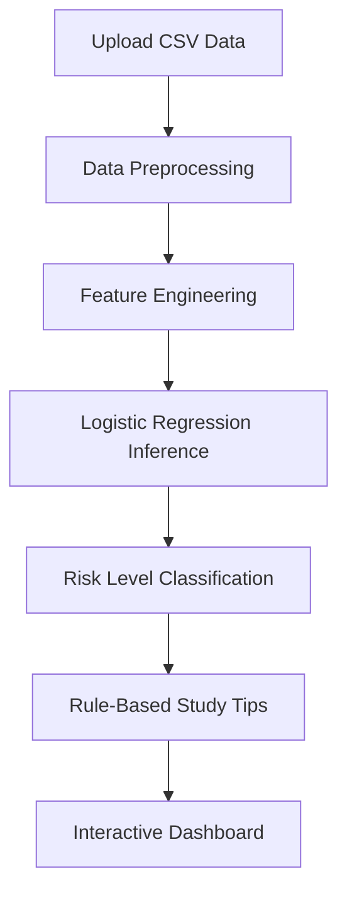
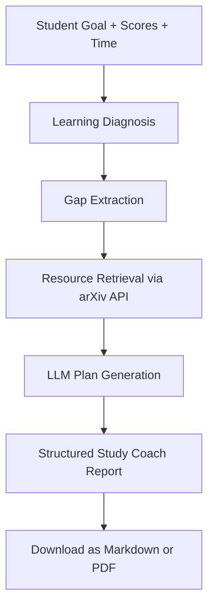

# Intelligent Learning Analytics and Agentic Study Coach

This project builds a learning analytics system in two milestones:

- **Milestone 1 (ML analytics):** preprocess student data, classify risk/performance levels, and provide baseline recommendations.
- **Milestone 2 (agentic AI coach):** diagnose learning gaps from student scores/goals, retrieve relevant resources, and generate structured multi-week study plans.

The application is implemented with **Streamlit** and designed for **public hosting** with free/open-source components.

## Datasets

- Students Performance in Exams (Kaggle): [https://www.kaggle.com/datasets/spscientist/students-performance-in-exams](https://www.kaggle.com/datasets/spscientist/students-performance-in-exams)
- Student Performance (UCI): [https://archive.ics.uci.edu/ml/datasets/student+performance](https://archive.ics.uci.edu/ml/datasets/student+performance)
- arXiv metadata (for retrieval extension): [https://www.kaggle.com/datasets/Cornell-University/arxiv](https://www.kaggle.com/datasets/Cornell-University/arxiv)

## Project Structure

- `app.py` - Streamlit UI (Milestone 1 + Milestone 2 pages)
- `src/data_preprocessing.py` - preprocessing and feature preparation
- `src/models.py` - training and model persistence
- `src/recommendations.py` - rule-based recommendation logic (Milestone 1)
- `src/study_coach.py` - diagnosis, planning orchestration, structured report generation
- `src/resource_retrieval.py` - arXiv API retrieval for learning resources
- `src/llm_client.py` - free/open-source LLM integration with fallback
- `src/pdf_export.py` - PDF export for study plan reports
- `models/` - saved model/scaler/encoders artifacts
- `data/` - input datasets
- `notebooks/` - EDA and experimentation

## Setup

1. Install dependencies:

   ```bash
   python3 -m pip install -r requirements.txt
   ```

2. Run the Streamlit app:

   ```bash
   streamlit run app.py
   ```

3. (Optional) Retrain Milestone 1 model:

   ```bash
   python3 src/models.py
   ```

## Milestone 1: ML-Based Learning Analytics

### Inputs

- CSV student data including scores and demographic/context features.

### Pipeline



### Milestone 1 Features

- Cleans and encodes categorical student attributes.
- Computes performance category (`At-risk`, `Average`, `High-performing`).
- Trains and serves Logistic Regression risk classifier.
- Visualizes score/risk distributions in dashboard.

## Milestone 2: Agentic AI Study Coach

### Objective

Extend analytics into an AI study coach that:

- accepts student goals,
- diagnoses learning gaps,
- creates a multi-step personalized plan,
- retrieves and cites learning resources (URLs),
- provides next-step progress guidance.

### Agentic Workflow



### Milestone 2 Features Implemented

- New **AI Study Coach** page in Streamlit UI.
- Goal-aware diagnosis with risk and gap reasoning.
- Multi-week personalized plan generation.
- arXiv-based resource retrieval and URL recommendations.
- Session memory (history of generated plans in current session).
- Report export in **Markdown** and **PDF**.

### LLM and Free-Tier Compliance

- Uses only free/open-source paths:
  - **Hugging Face Inference API** (when token is available), or
  - **Local open-source model** via `transformers`.
- If model inference is unavailable, app uses a **rule-based fallback** to still produce the required structured report.

### Optional Environment Variable

For better hosted performance, set:

- `HF_API_TOKEN=<your_huggingface_token>`

If not set, the app attempts local inference and then safe fallback behavior.

## Required Structured Output (Milestone 2)

Generated coach report includes:

- Learning diagnosis
- Personalized study plan
- Weekly goals
- Recommended learning resources (URLs)
- Progress feedback / next steps

## UI Pages

- `Home` - overview and project status
- `Batch Data` - upload CSV and run batch analysis/risk prediction
- `Get Recommendations` - quick individual recommendations
- `AI Study Coach` - full milestone 2 agentic coach workflow
- `Info` - app context

## Limitations

- LLM output quality depends on model availability and inference latency.
- arXiv retrieval may return research-oriented resources rather than beginner tutorials.
- Session memory is runtime-based (not persistent database memory).

## Submission Checklist

- Publicly hosted app link (Streamlit/HF/Render)
- GitHub repository link
- Demo video (5-7 minutes) covering Milestone 1 + Milestone 2 flows
